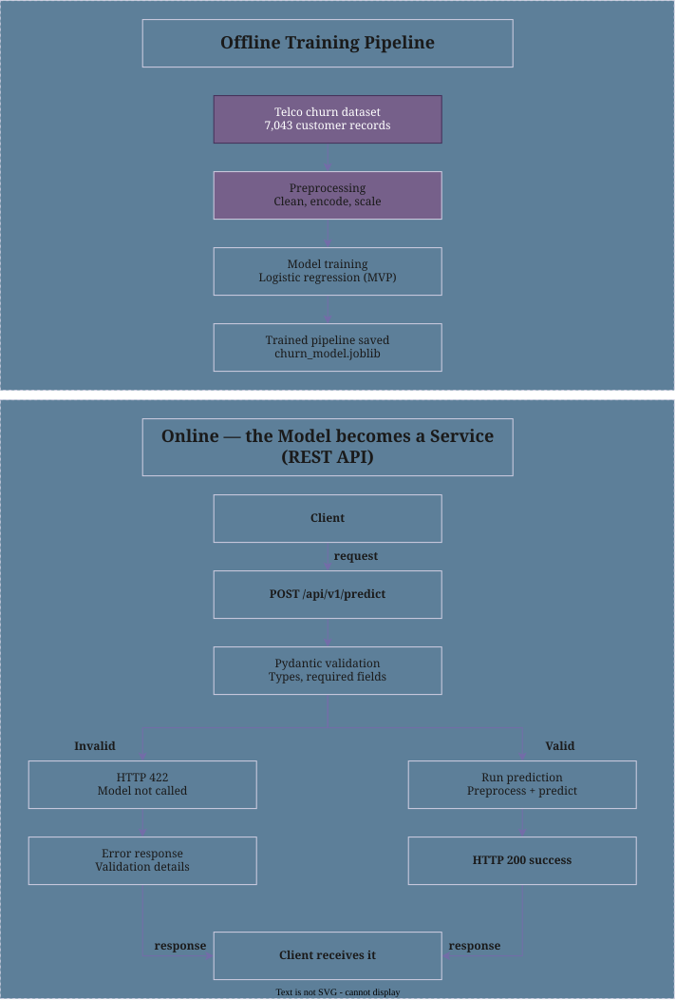

# ML Model Deployment as a Monitored REST API

## Project Overview

This project builds a **Customer Churn Prediction API** using the Telco Customer Churn dataset and a Logistic Regression model. The trained model is served through **FastAPI**, exposing prediction endpoints that determine whether a customer is likely to churn or stay.

---

## Dataset — Telco Customer Churn (IBM Dataset)

| Attribute        | Value                                       |
| ---------------- | ------------------------------------------- |
| **Type**         | Tabular                                     |
| **Domain**       | Telecommunications                          |
| **Records**      | 7,043 customers                             |
| **Raw features** | 33 (19 used after cleaning)                 |
| **Problem type** | Binary classification                       |
| **Target**       | `Churn Value` → `1` = churned, `0` = stayed |

**Source:** [Telco Customer Churn — IBM Dataset (Kaggle)](https://www.kaggle.com/datasets/yeanzc/telco-customer-churn-ibm-dataset)

### Preprocessing Pipeline

Before training, the dataset is prepared to keep only relevant and reliable information.

The planned preprocessing includes:

1. Remove unnecessary fields
2. Remove duplicate and leakage-related fields
3. Handle missing values
4. Select relevant features
5. Encode categorical features
6. Scale numerical features
7. Combine everything into a single ML pipeline

---

## ML Model

**Logistic Regression** — a simple binary classification model used to predict whether a customer is likely to churn or stay.

The trained model is stored at:

```text
ml/saved_model/model.joblib
```

---

## API Contract — Customer Churn Prediction

The Customer Churn Prediction API defines how a client application communicates with the machine learning service.

The API uses the **HTTP `POST`** method through the `/api/v1/predict` endpoint to receive 19 customer input fields in JSON format, validates the request using **Pydantic**, and passes valid data to the trained ML pipeline.

On a successful request, the API returns **HTTP `200 OK`** with the customer's churn prediction, a confidence score, a server-generated request ID, and the response time.

If the input is invalid, the API returns **HTTP `422 Unprocessable Entity`** without calling the ML model.

| Key Element          | Definition                                                                               |
| -------------------- | ---------------------------------------------------------------------------------------- |
| **Endpoint**         | `/api/v1/predict`                                                                        |
| **HTTP Method**      | `POST`                                                                                   |
| **Input**            | 19 customer features required by the trained pipeline                                    |
| **Request Format**   | JSON                                                                                     |
| **Input Validation** | Pydantic validates data types, required fields, allowed categories, and numerical values |
| **ML Processing**    | Valid data is passed to the trained Scikit-Learn pipeline                                |
| **Prediction**       | `1` → Churn, `0` → No Churn                                                              |
| **Success Status**   | `200 OK`                                                                                 |
| **Success Response** | Prediction, confidence, request ID, and response time                                    |
| **Failure Status**   | `422 Unprocessable Entity` for invalid input                                             |
| **Failure Handling** | Invalid requests are rejected before reaching the ML model                               |
| **Request ID**       | Generated by the server                                                                  |
| **Response Time**    | Time taken by the API to process the prediction request                                  |
| **Response Format**  | JSON                                                                                     |

---

## API Endpoints

| Endpoint          | Method | Purpose                                 |
| ----------------- | ------ | --------------------------------------- |
| `/api/v1/health`  | `GET`  | Check whether the API is running        |
| `/api/v1/predict` | `POST` | Predict customer churn                  |
| `/api/v2/predict` | `POST` | Predict customer churn using the v2 API |

Interactive API documentation is available through Swagger UI:

```text
http://localhost:8000/docs
```

---

## Architecture Diagram



---

## How to Run This Project

### Prerequisites

Make sure the following are installed:

* Docker Desktop
* Docker Compose
* A `.env` file in the project root

If `.env` does not exist, copy `.env.example` and fill in the required values.

---

### Run with Docker Compose

From the project root directory, run:

```bash
docker compose up --build
```

This command:

1. Builds the Docker image.
2. Creates the Docker Compose network.
3. Creates the API container.
4. Loads environment variables from `.env`.
5. Mounts the trained model directory.
6. Starts the FastAPI application.

The API will be available at:

* **Swagger UI:** http://localhost:8000/docs
* **Health check:** http://localhost:8000/api/v1/health

---

### Stop the Application

To stop and remove the Docker Compose container and network:

```bash
docker compose down
```

The Docker image and host files are not removed.

---

### Docker Model Volume

The trained model directory is mounted into the container using a bind mount:

```yaml
volumes:
  - ./ml/saved_model:/app/ml/saved_model
```

This allows the container to use the model stored on the host machine.

The model can therefore be replaced without rebuilding the Docker image.

---

### Swap in a Retrained Model Without Rebuilding

Replace the existing model file:

```text
ml/saved_model/model.joblib
```

with the newly trained model.

Then restart the API:

```bash
docker compose restart
```

The container will load the model from the mounted `ml/saved_model` directory.

---

## Docker Configuration

The project uses:

* **Python 3.12**
* **Docker**
* **Docker Compose**
* **FastAPI**
* **Uvicorn**
* **Scikit-Learn**
* **Joblib**

The Docker image exposes port `8000`:

```text
Host:8000 → Container:8000
```

The application listens on:

```text
0.0.0.0:8000
```

so that it is accessible through the Docker port mapping.

---

## Project Structure

```text
customer-churn-ml-api/
│
├── app/
│   └── ...
│
├── ml/
│   └── saved_model/
│       └── model.joblib
│
├── data/
│   └── ...
│
├── tests/
│   └── ...
│
├── logs/
│   └── ...
│
├── Dockerfile
├── docker-compose.yml
├── .dockerignore
├── .env
├── .env.example
├── requirements.txt
├── README.md
└── Architectural_Diagram.svg
```

---

## Docker Compose Service

The application is configured as an `api` service in `docker-compose.yml`.

The Compose configuration provides:

* Docker image build configuration
* Port mapping
* Environment variable loading
* Model directory bind mount
* Automatic container restart

The service can be started with:

```bash
docker compose up
```

or rebuilt and started with:

```bash
docker compose up --build
```

---

## Monitoring and API Response

The API provides information such as:

* Customer churn prediction
* Prediction confidence
* Server-generated request ID
* API response time
* Health status

These details help with API monitoring, debugging, and operational visibility.
